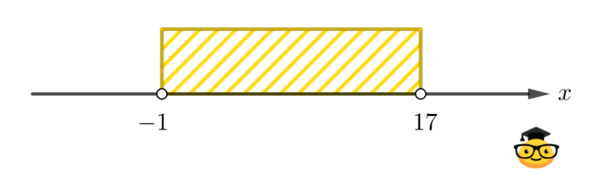

Write a program that takes an integer x and determines whether it belongs to the specified range. 

Input data format:
The input to the program is an integer x.

Output data format:
The program should output the text according to the problem's condition.

Note. If the point is gouged, the boundary is not included, if the point is painted over, the boundary is included.