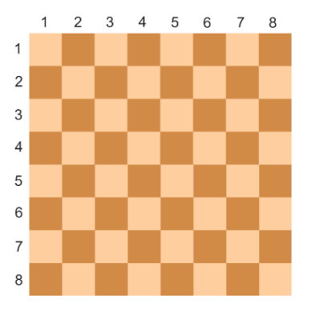

There are two squares on a chessboard. Write a program that determines whether the specified squares have the same color or not. If they are of the same color print "YES", and if they are of different colors print "NO".

The format of the input:
The input is four numbers from 1 to 8 each, giving the column number and row number for the first cell and then for the second cell.

Output format:
The program should output the text according to the problem's condition.

