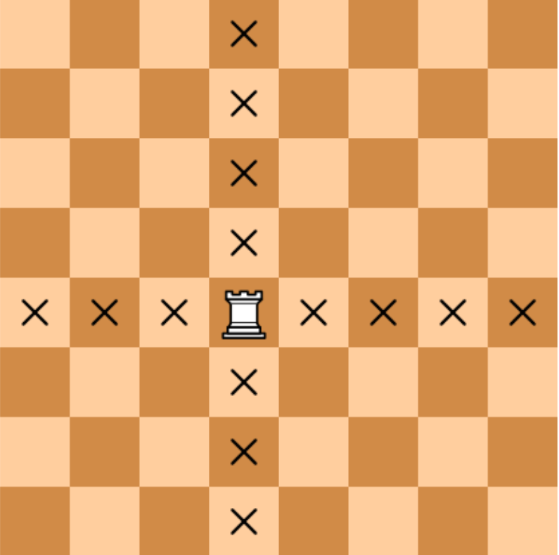

There are two different squares on a chessboard. Write a program that determines whether the rook can get from the first square to the second one in a single move. The program receives four numbers from 1 to 8 each, giving the column number and row number first for the first square and then for the second square. The program should output "YES" if the rook can be moved from the first square to the second, or "NO" otherwise.

The format of the input:
There are four numbers from 1 to 8 at the input of the program.

Output format:
You should print the text as specified by the problem.

Note. The rook moves horizontally or vertically.