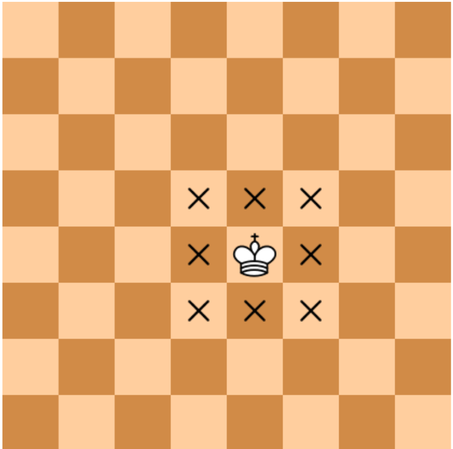

There are two different squares on a chessboard. Write a program that determines whether the king can get from the first square to the second square in one move. The program receives four numbers from 1 to 8 each, giving the column number and row number first for the first square and then for the second square. The program should output "YES" if the king moves from the first square to the second, or "NO" otherwise.

The format of the input:
Four numbers from 1 to 8 are given as input.

Output format:
The program should print the text according to the problem's condition.

Note. The chess king moves horizontally, vertically, and diagonally, but only by 1 square.