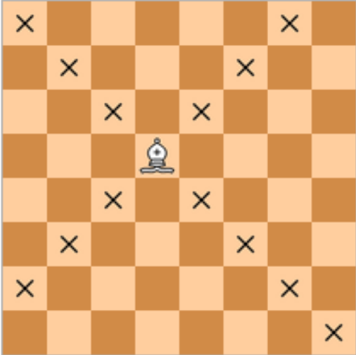

There are two different squares on a chessboard. Write a program that determines whether the bishop can get from the first square to the second one with a single move. The program receives four numbers from 1 to 8 each, giving the column number and row number first for the first square, then for the second square. The program should print "YES" if the bishop can move from the first square to the second, or "NO" otherwise.

The format of the input
The input is four numbers from 1 to 8.

Output format
You should print the text as specified by the problem.

Note. The chess bishop walks diagonally.

