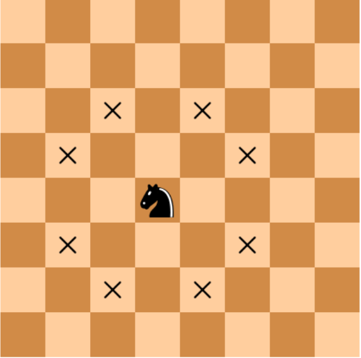

There are two different squares on a chessboard. Write a program that determines if the knight can get from the first square to the second one with one move. The program receives four numbers from 1 to 8 each, giving the column number and row number for the first square and then for the second square. The program should print "YES" if the knight can get from the first square to the second or "NO" otherwise.

The format of the input
This program inputs four numbers from 1 to 8.

Output format
This program should print the text as specified by the problem.

