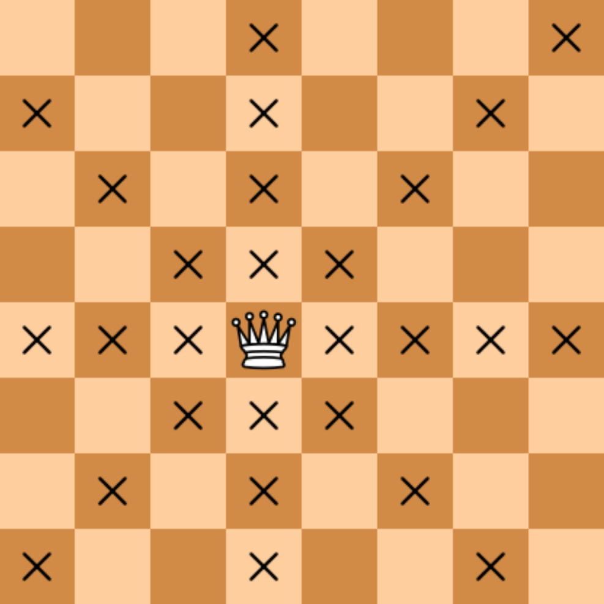

There are two different squares on a chessboard. Write a program that determines if the queen can get from the first square to the second one in one move. The program receives four numbers from 1 to 8 each, giving the column number and row number first for the first square, then for the second square. The program should print "YES" if the queen moves from the first square to the second, or "NO" otherwise.

The format of the input
Four numbers from 1 to 8 are given as input to the program.

Output format
This program should print the text according to the problem's condition.

Note. The chess queen moves diagonally, horizontally, or vertically.

